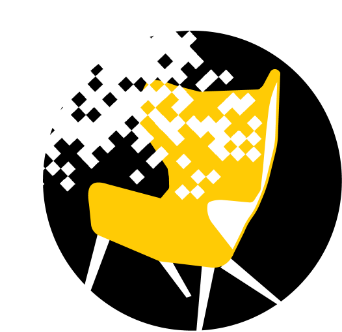

  

# Furniture Augmented Reality App (FAR APP)

This was a project for my Mobile Computing class where Bader Al-Jumaah and I developed an interior design augmented reality android application to allow users to design their house before buying the actual furniture. The app can be downloaded from our website [FAR APP](https://www.far.helep0d.xyz/). 

The project uses the following technologies:
  - AR CORE by Google
  - Sceneform by google
  - AppIntro by [@cortinico](https://github.com/cortinico) and [@paolorotolo](https://github.com/paolorotolo)

# Features

  - Easy AR object placement
  - Simple and Clean UI
  - Realistic virtual furniture from Poly.google.com

# License

BSD 3-Clause License

# Copyright Disclaimer

This project is the property of [FAR APP](https://www.far.helep0d.xyz/) developers and if used somewhere else the developers must be mentioned and tagged to avoid legal problems.

Developers:
-[@ayman](https://github.com/AymanKandil)
-[@Bader](https://github.com/BaderAlJuma)

**FAR APP is a non-profitable application and it is available for free**

